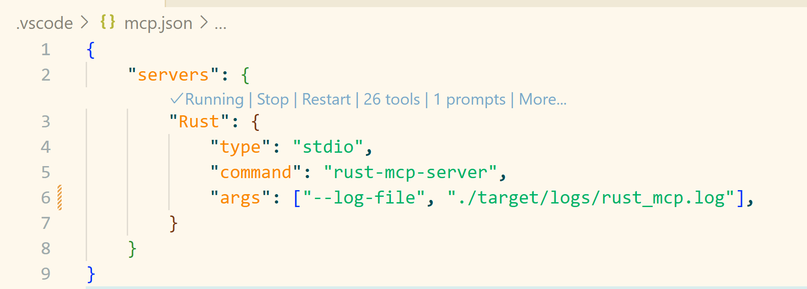

# RustMCP

RustMCP is a server that implements the [Model Context Protocol (MCP)](https://modelcontextprotocol.io/introduction). It acts as a bridge between a large language model (LLM) like GitHub Copilot and your local Rust development environment.

By exposing local tools and project context to the LLM, RustMCP allows the model to perform actions on your behalf, such as building, testing, and analyzing your Rust code.

## Why use RustMCP?

Integrating an LLM with your local development environment via RustMCP can significantly enhance your productivity. The LLM can:

*   **Automate common tasks**: Run `cargo check`, `cargo build`, `cargo test`, and `cargo fmt` directly.
*   **Manage dependencies**: Add new dependencies with `cargo add`, find unused dependencies with `cargo-machete`
*   **Apply Rust best practices**: Use `cargo clippy` to lint your code and catch common mistakes, ensuring adherence to Rust guidelines. The LLM can also leverage other tools to help you write idiomatic and robust Rust code.

Essentially, it turns your AI assistant into an active participant in your development workflow, capable of executing commands and helping you manage your project.

## Features

RustMCP exposes several `cargo` commands as tools to the LLM:

*   `cargo build`: Compile your package.
*   `cargo check`: Analyze the current package and report errors, but don't build it.
*   `cargo test`: Run the tests.
*   `cargo fmt`: Format the code according to the project's style.
*   `cargo add`: Add dependencies to your `Cargo.toml`.
*   `cargo-deny`: Check for security advisories, license compatibility, and banned crates.
*   `cargo-machete`: Find unused dependencies.

and others.

## Getting Started

### Prerequisites

1.  **Rust**: You need the Rust toolchain installed. You can get it from [rustup.rs](https://rustup.rs/).
2.  [*Optional*] **cargo-deny**: Install with `cargo install cargo-deny`.
3.  [*Optional*] **cargo-machete**: Install with `cargo install cargo-machete`.

### Building the Server

1.  Clone this repository.
2.  Build the server in release mode:
    ```sh
    cargo build --release
    ```
    The executable will be located at `target/release/rustmcp.exe`.

### Configuring with VS Code

To make GitHub Copilot in VS Code use this MCP server, you need to update your VS Code settings.

1.  Enable MCP server in VS Code settings - [⚙️chat.mcp.enabled](vscode://settings/chat.mcp.enabled)
1.  Add new MCP server into `.vscode/mcp.json`.

    ```json
    {
        "servers": {
            "RustMcp": {
                "type": "stdio",
                "command": "C:/path/to/your/rustmcp.exe",
                "args": ["--log-file", "log/folder/rustmcp.log"],
            }
        }
    }
    ```
1. Start the server
   

More information you can find by this [link](https://code.visualstudio.com/docs/copilot/chat/mcp-servers).
